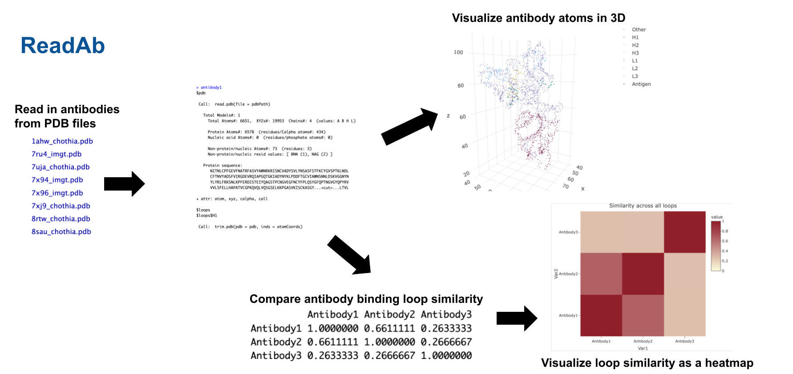

<!-- README.md is generated from README.Rmd. Please edit that file -->

# ReadAb

A package used to read in and work with antibodies from PDBs.

## Description

`ReadAb` is a package used to work with antibodies stored in PDB files.
It facilitates the reading of antibodies from PDB files renumbered with
any of the Kabat, Chothia, IMGT, or AHo/Honegger schemes to denote the
locations of complimentarity determining regions (CDRs) (A.K.A. binding
loops.) This toolkit enables researchers to compare binding specificity
between multiple antibodies by comparing aligned loop sequences.
`ReadAb` offers tools for visualizing antibodies with color coded
components (loops, antigen, other), and for visualizing loop similarity
matrices using heatmaps. `ReadAb` was developed using
`R version 4.4.1 (2024-06-14)`, `Platform: aarch64-apple-darwin20`, and
`Running under: macOS Sonoma 14.2.1`.

The package uses a small subset of the SabDab human dataset
(<https://opig.stats.ox.ac.uk/webapps/sabdab-sabpred/sabdab>) which
contains a variety of antibody-antigen-complex structures.

This package was built as an R package, and was developed as a part of a
course project for \[BCB410H1: Applied Bioinformatics\]

More information on antibody structures available
[here](https://pmc.ncbi.nlm.nih.gov/articles/PMC8163984/#sec1)

For information on antibody numbering schemes, see [this
article](https://www.frontiersin.org/journals/immunology/articles/10.3389/fimmu.2018.02278/full)

## Installation

To install the latest version of the package:

``` r
install.packages("devtools")
library("devtools")
devtools::install_github("claregillis/ReadAb", build_vignettes = TRUE)
library("ReadAb")
```

NOTE: I am having issues with the vignette failing to build, so you may
need to install using

``` r
devtools::install_github("claregillis/ReadAb", build_vignettes = FALSE)
```

## Overview

``` r
ls("package:ReadAb")
data(package = "ReadAb") 
browseVignettes("ReadAb")
```

`ReadAb` contains 8 functions.

1.  ***ReadAntibody*** for reading a PDB file containing an antibody
    using a selected numbering scheme to identify CDR loops

2.  ***GetLoopSequence*** to get the sequence of a loop in an antibody

3.  ***SetComponentColor*** to set the color of a component in an
    antibody (specific loop, antigen, other) for future visualization

4.  ***AlignLoop*** to align a given loop for multiple antibodies (ex.
    H3 loop of 3 antibodies)

5.  ***AssessLoopSimilarity*** for determining the similarity between
    the given loop for each pair of antibodies provided

6.  ***AssessOverallLoopSimilarity*** for determining the similarity of
    ALL loops (loops may be weighted) for each pair of antibodies
    provided

7.  ***DisplaySimilarityPlot*** for displaying the similarity matrices
    gathered from `assessLoopSimilarity` and
    `assessOverallLoopSimilarity`

8.  ***VisualizeAntibody*** for displaying the atoms of the antibody
    with color coded components

The package also contains a dataset of PDB files from the SabDab
database. Refer to package vignettes for more details. An overview of
the package is illustrated below.

**Figure 1.** An overview of the ReadAb high level workflow.


## Contributions

My name is Clare Gillis and I am the sole author of this package. I am
currently working at [Fable
Therapeutics](https://www.fabletherapeutics.com/) on a project involved
in antibody design. I wanted to create a useful toolkit for manipulating
anitbodies in R since there are none that I am aware of.

The `bio3d` package which reads and stores pdb objects was relied upon
in ReadAntibody for reading a pdb and storing the contants and its
loops. The `plotly` package is used in both VisualizeAntibody and
DisplaySimilarityMatrix to display plots (an interactive 3D plot in the
former, and a heatmap in the latter.) The `Biostrings` package is used
in the alignLoop function to represent the amino acid sequenc of the
loop, and the `DECIPHER` package is used in alignLoops and
assessLoopSimilarity to align sequences and calculate a distance matrix
between them.

Generative AI was used to help with creating unit tests for each
function. Specifically, ChatGPT was prompted with the contents of the
function and it generated a series of unit tests that were then edited
by the author. Furthermore, ChatGPT was used for assistance during
debugging. Specifically, it was prompted with the contents of a function
and an error, then identified the location of the bug. More information
on ChatGPT is available [here](https://openai.com/index/chatgpt/)

## References

- Chiu, M. L., Goulet, D. R., Teplyakov, A., & Gilliland, G. L. (2019).
  Antibody structure and function: The basis for engineering
  therapeutics. *Antibodies* (Basel), 8(4), Article 55.
  <https://doi.org/10.3390/antib8040055>

- Chothia, C., Lesk, A. M., Tramontano, A., Levitt, M., Smith-Gill, S.
  J., Air, G., et al. (1989). Conformations of immunoglobulin
  hypervariable regions. *Nature*, 342:6252, 877–883. Available from:
  <https://www.nature.com/articles/342877a0>

- Dondelinger, M., Filée, P., Sauvage, E., Quinting, B., Muyldermans,
  S., Galleni, M., & Vandevenne, M. S. (2018). Understanding the
  significance and implications of antibody numbering and
  antigen-binding surface/residue definition. *Frontiers in Immunology*,
  9, Article 2278. <https://doi.org/10.3389/fimmu.2018.02278>

- Dunbar, J., Krawczyk, K., Leem, J., Baker, T., Fuchs, A., Georges, G.,
  Shi, J., & Deane, C. M. (2014). SAbDab: The structural antibody
  database. *Nucleic Acids Research*, 42(D1), D1140–D1146.
  <https://doi.org/10.1093/nar/gkt1043>

- Grant, B. J., Skjaerven, L., & Yao, X. Q. (2021). The Bio3D packages
  for structural bioinformatics. *Protein Science*, 30(1), 20–30.
  <https://doi.org/10.1002/pro.3923>

- Honegger, A., Plückthun, A. (2001). Yet Another Numbering Scheme for
  Immunoglobulin Variable Domains: An Automatic Modeling and Analysis
  Tool. *J Mol Biol*, 309(3), 657–670.

- Kabat EA, Te Wu T, Bilofsky H, (U.S.) NI of H. Sequences of
  Immunoglobulin Chains: Tabulation and Analysis of Amino Acid Sequences
  of Precursors, V-regions, C-regions, J-Chain and
  BP-Microglobulins, 1979. Department of Health, Education, and Welfare,
  Public Health Service, National Institutes of Health (1979). Available
  online at: <https://books.google.com/books?id=OpW8-ibqyvcC>

- Lefranc, M. P., Lefranc, G. (2020). Immunoglobulins or Antibodies:
  IMGT® Bridging Genes, Structures and Functions. *Biomedicines*,
  8(9):319. Available from: <https://www.mdpi.com/2227-9059/8/9/319/htm>

- Pagès, H., Aboyoun, P., Gentleman, R., & DebRoy, S. (2024).
  Biostrings: Efficient manipulation of biological strings (R package
  version 2.72.1). <https://doi.org/10.18129/B9.bioc.Biostrings>

- R Core Team (2023). R: A language and environment for statistical
  computing. R Foundation for Statistical Computing, Vienna, Austria.
  <https://www.R-project.org/>

- Sievert, C. (2020). Interactive Web-Based Data Visualization with R,
  plotly, and shiny. Chapman and Hall/CRC Florida.

- Wickham, H. (2007). Reshaping data with the reshape package. *Journal
  of Statistical Software*, 21(12).

- Wickham H, François R, Henry L, Müller K, Vaughan D (2023). *dplyr: A
  Grammar of Data Manipulation*. R package version 1.1.4.
  <https://CRAN.R-project.org/package=dplyr>

- Wilson, I. A., & Stanfield, R. L. (2021). 50 years of structural
  immunology. *Journal of Biological Chemistry*, 296, Article 100745.
  <https://doi.org/10.1016/j.jbc.2021.100745>

- Wright, E. S. (2016). “Using DECIPHER v2.0 to Analyze Big Biological
  Sequence Data in R.” *The R Journal*, 8(1), 352-359.

## Acknowledgements

This package was developed as part of an assessment for 2024 BCB410H:
Applied Bioinformatics course at the University of Toronto, Toronto,
CANADA. `ReadAb` welcomes issues, enhancement requests, and other
contributions. To submit an issue, use the [GitHub
issues](https://github.com/claregillis/ReadAb/issues). Many thanks to
those who provided feedback to improve this package.
